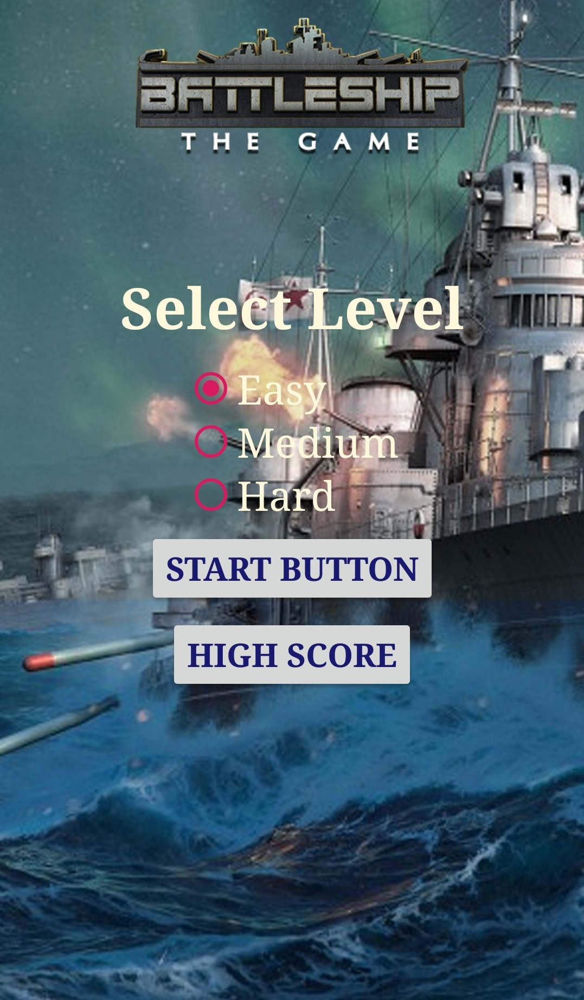
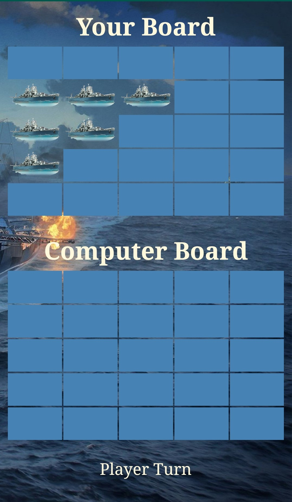
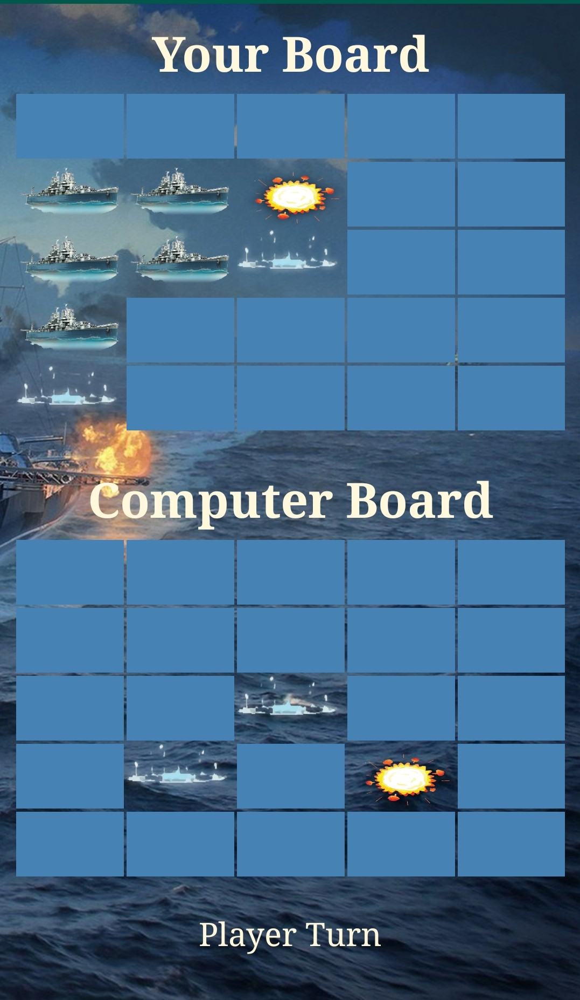
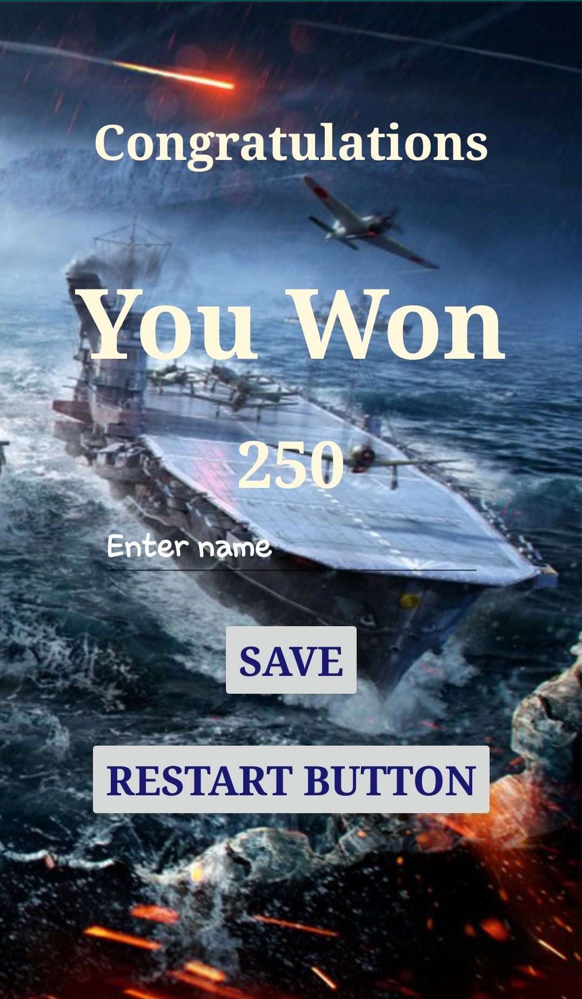
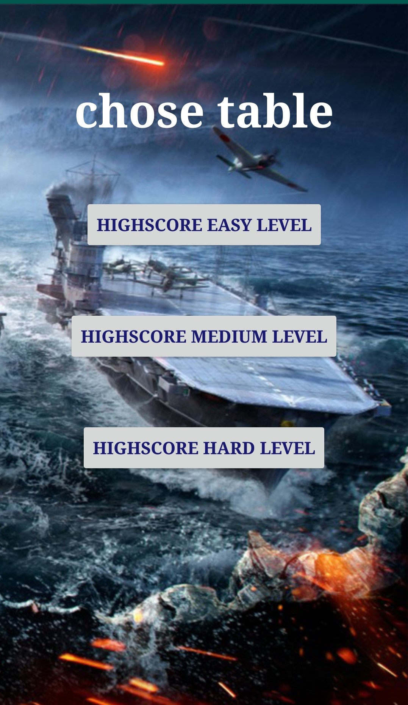

# BattleshipGame
Battleship is a strategy type guessing game for two players.

It is played on ruled grids on which each player's fleet of ships are marked. 
The locations of the fleets are concealed from the other player. 

Players alternate turns calling "shots" at the other player's ships,
and the objective of the game is to destroy the opposing player's fleet.

The game contains 3 difficulty levels, for each level, the victories can be saved.
The player is playing in front of a computer.

The position of the ships was determined using an algorithm developed.

Using sensorEvent to move the ships during the game to challenge the player.

  

 
